```mermaid
flowchart TD
    A[æ€è€ƒReasoning🧠] --> B[行动ActionğŸ–ï¸]
    B --> C[观察Observation👀]
    C -.->|å馈循ç¯ğŸ”| A

```

# ReAct 思考行为模式


流程图 从上到下 flowchart from top to down
```mermaid
flowchart TD
    User[“用户/老师<br>提出问题（出题）”]
    
    subgraph 组委会与规则 [“考试组委会与规则”]
        Framework[“组织者: LangChain等框架”]
        MCP[“个人工具规则: MCP”]
        A2A[“协作协议: A2A”]
    end
    
    subgraph 资料库 [“开卷考试的资料库”]
        VD[(“智能管理员<br>Vector Database”)]
        RAG_Process[“核心流程: RAG”]
    end
    
    User -- “传达指令<br>（Prompt Engineering）” --> AI_Student
    
    AI_Student -- “需要知识时查询” --> RAG_Process
    RAG_Process -- “检索相关片段” --> VD
    
    AI_Student -- “需要工具时调用” --> Tool_Calling
    Tool_Calling -- “遵循规则使用” --> MCP
    Tool_Calling -- “与其他AI协作” --> A2A
    
    Framework -- “协调与组装<br>所有组件” --> AI_Student
    Framework -- “接入与管理” --> 资料库
    Framework -- “定义与调度” --> Tool_Calling
    
    style AI_Student fill:#e1f5fe
    style RAG_Process fill:#f3e5f5
    style Framework fill:#fff3e0
```

# 认知金字塔 Re-act(思考行动观察)其实就是简单版的OODA循环 把决策和判断浓缩为了思考
```mermaid
flowchart TD
    subgraph 认知层次金字塔
        direction BT
        
        subgraph 高级认知 [完整认知循环]
            A1[感知观察] --> 
            A2[深度理解] -->
            A3[多步推理] -->
            A4[理性决策] -->
            A5[计划行动] --> A1
        end
        
        subgraph 中级认知 [模式识别反应]
            B1[感知模式] --> 
            B2[快速匹配] --> 
            B3[习惯反应] --> B1
        end
        
        subgraph 基础认知 [条件反射]
            C1[刺激感知] --> 
            C2[自动反应] --> C1
        end
    end

    A5 -- 高度熟练后 --> B3
    B3 -- 重复练习后 --> C2

    C2 -- 学习 --> B1
    B3 -- 学习 --> A1


    
    style 认知循环 fill:#e8f5e8
    style 模式识别 fill:#fff3e0
    style 条件反射 fill:#e1f5fe

```